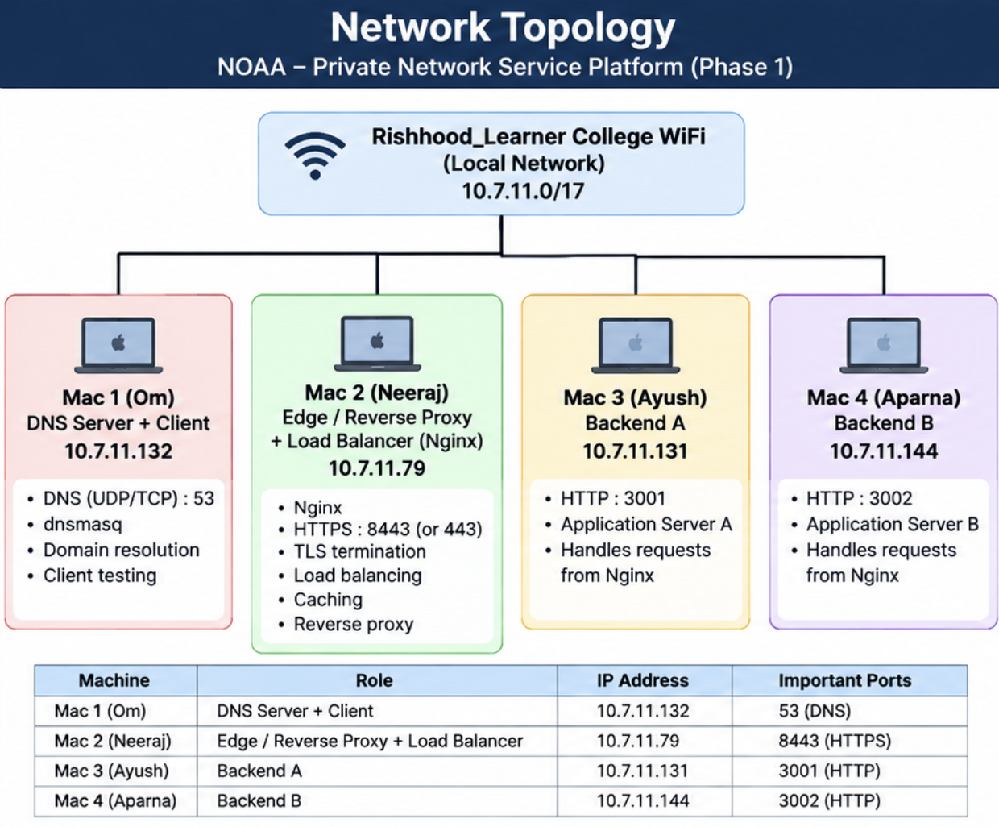
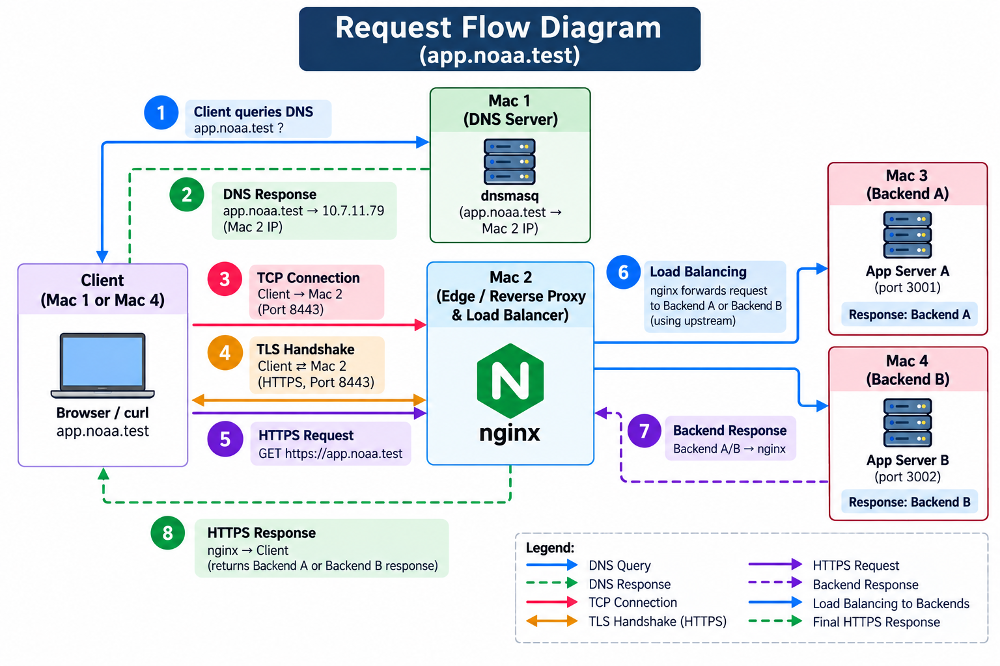

# 🌐 NOAA — Private Network Service Platform

### Computer Networks Course Project — Phase 1

> **LAN → DNS → TCP → TLS → HTTPS → Nginx Reverse Proxy → Load Balancing → Backend → HTTP Caching → Wireshark Analysis**

A fully local private network service platform built using multiple
macOS machines connected to the same private LAN.

The project demonstrates how a real client request travels through
different networking layers and services, from DNS resolution to an
HTTPS response generated by one of two backend servers.

---

# 📌 Table of Contents

- [Project Overview](#-project-overview)
- [Project Objectives](#-project-objectives)
- [Phase 1 Architecture](#-phase-1-architecture)
- [Network Topology](#-network-topology)
- [Machine and IP Configuration](#-machine-and-ip-configuration)
- [Complete Request Flow](#-complete-request-flow)
- [Protocol Stack](#-protocol-stack)
- [Phase 1 Tasks](#-phase-1-tasks)
  - [01 — LAN Setup](#01--lan-setup)
  - [02 — Private DNS](#02--private-dns)
  - [03 — Backend Services](#03--backend-services)
  - [04 — Nginx Reverse Proxy and Load Balancing](#04--nginx-reverse-proxy-and-load-balancing)
  - [05 — TLS and HTTPS](#05--tls-and-https)
  - [06 — HTTP Caching](#06--http-caching)
  - [07 — Wireshark Analysis](#07--wireshark-analysis)
  - [08 — Failure Demonstrations](#08--failure-demonstrations)
- [Request Lifecycle](#-request-lifecycle)
- [Repository Structure](#-repository-structure)
- [Configuration Files](#-configuration-files)
- [Evidence Structure](#-evidence-structure)
- [Tools Used](#-tools-used)
- [Security](#-security)
- [Phase 1 Demonstration Flow](#-phase-1-demonstration-flow)
- [Phase 1 Completion Checklist](#-phase-1-completion-checklist)
- [Learning Outcomes](#-learning-outcomes)
- [Final Architecture](#-final-architecture)

---

# 📌 Project Overview

Team **NOAA** designed and implemented a private network service
platform using four macOS machines connected to the same private LAN.

The application uses a private `.test` domain:

```text
app.noaa.test
```

The client does not directly access the backend servers.

Instead, the request passes through a complete networking pipeline:

```text
Client
  │
  │ DNS
  ▼
Private DNS Server
  │
  │ IP Address
  ▼
Nginx Edge Server
  │
  │ TCP
  │ TLS
  │ HTTPS
  ▼
Reverse Proxy
  │
  │ Load Balancing
  ├───────────────┐
  ▼               ▼
Backend A       Backend B
:3001           :3002
  │               │
  └───────┬───────┘
          ▼
      HTTP Response
          │
          ▼
        Client
```

The main purpose of Phase 1 is to **build the core network infrastructure,
observe the network traffic, and prove that each component works using
networking tools and evidence**.

---

# 🎯 Project Objectives

The main objectives of Phase 1 are:

- Build a private LAN using multiple macOS machines.
- Configure a private DNS server.
- Use the reserved `.test` namespace.
- Resolve the private application domain.
- Run two backend application services.
- Configure Nginx as a reverse proxy.
- Configure Nginx as a load balancer.
- Configure HTTPS using TLS certificates.
- Observe TCP and TLS handshakes using Wireshark.
- Demonstrate HTTP caching.
- Demonstrate controlled failure scenarios.
- Capture screenshots and packet-level evidence.
- Organize all Phase 1 evidence into clearly named folders.
- Understand how DNS, TCP, TLS, HTTP, Nginx, load balancing, caching,
  and backend services work together.

---

# 🏗️ Phase 1 Architecture

The complete Phase 1 system consists of four machines.

```text
                         PRIVATE LAN
                              │
              ┌───────────────┼───────────────┐
              │               │               │
              ▼               ▼               ▼
        ┌──────────┐    ┌────────────┐   ┌──────────┐
        │  Mac 1   │    │   Mac 2    │   │  Mac 3   │
        │   DNS    │    │   Nginx    │   │ Backend A│
        │  .132    │    │    .79     │   │   .131   │
        │   :53    │    │   :8443    │   │   :3001  │
        └──────────┘    └─────┬──────┘   └──────────┘
                               │
                               │
                               ▼
                         ┌──────────┐
                         │  Mac 4   │
                         │ Backend B│
                         │   .144   │
                         │   :3002  │
                         └──────────┘
```

---

# 🖥️ Machine and IP Configuration

| Machine | Role | IP Address | Service / Port |
|---|---|---|---|
| **Mac 1** | Private DNS Server + Client | `10.7.11.132` | DNS `53` |
| **Mac 2** | Nginx Edge / Reverse Proxy / Load Balancer | `10.7.11.79` | HTTPS `8443` |
| **Mac 3** | Backend A | `10.7.11.131` | HTTP `3001` |
| **Mac 4** | Backend B + Test Client | `10.7.11.144` | HTTP `3002` |

All four machines are connected to the same private local network.

---

# 🗺️ Network Topology

The project topology is documented in:

```text
architecture/network-topology.png
```



### Logical topology

```text
                   ┌─────────────────────┐
                   │     Private LAN     │
                   └──────────┬──────────┘
                              │
          ┌───────────────────┼───────────────────┐
          │                   │                   │
          ▼                   ▼                   ▼
   ┌─────────────┐     ┌─────────────┐     ┌─────────────┐
   │    Mac 1    │     │    Mac 2    │     │    Mac 3    │
   │     DNS     │     │    Nginx    │     │  Backend A  │
   │ 10.7.11.132 │     │ 10.7.11.79 │     │ 10.7.11.131 │
   │     :53     │     │    :8443    │     │    :3001    │
   └─────────────┘     └──────┬──────┘     └─────────────┘
                               │
                               ▼
                        ┌─────────────┐
                        │    Mac 4    │
                        │  Backend B  │
                        │ 10.7.11.144 │
                        │    :3002    │
                        └─────────────┘
```

---

# 🔄 Complete Request Flow

The complete request flow is documented in:

```text
architecture/request-flow.png
```



The client request follows this sequence:

```text
1. Client requests app.noaa.test
              │
              ▼
2. DNS resolves app.noaa.test
              │
              ▼
3. DNS returns 10.7.11.79
              │
              ▼
4. Client establishes TCP connection
              │
              ▼
5. TLS handshake takes place
              │
              ▼
6. HTTPS request reaches Nginx
              │
              ▼
7. Nginx acts as reverse proxy
              │
              ▼
8. Nginx selects a backend
              │
        ┌─────┴─────┐
        ▼           ▼
   Backend A    Backend B
     :3001        :3002
        │           │
        └─────┬─────┘
              ▼
9. Backend generates HTTP response
              │
              ▼
10. Nginx returns response to client
```

---

# 🧱 Protocol Stack

The project demonstrates multiple networking protocols and concepts.

| Layer / Concept | Technology | Purpose |
|---|---|---|
| Application | DNS | Converts domain name to IP address |
| Application | HTTP | Backend/application communication |
| Application | HTTPS | Secure web communication |
| Transport | TCP | Reliable connection |
| Security | TLS | Encryption and authentication |
| Network | IPv4 | Addressing between machines |
| Link | Wi-Fi / Ethernet | Local network communication |

---

# 🧩 Phase 1 Tasks

The Phase 1 workflow is:

```text
                 ┌─────────────┐
                 │ 01. LAN     │
                 └──────┬──────┘
                        │
                        ▼
                 ┌─────────────┐
                 │ 02. DNS     │
                 └──────┬──────┘
                        │
                        ▼
                 ┌─────────────┐
                 │03. Backends │
                 └──────┬──────┘
                        │
                        ▼
              ┌─────────────────────┐
              │04. Nginx + Load Bal.│
              └──────────┬──────────┘
                         │
                         ▼
              ┌─────────────────────┐
              │   05. TLS / HTTPS   │
              └──────────┬──────────┘
                         │
                 ┌───────┴────────┐
                 ▼                ▼
          ┌────────────┐   ┌─────────────┐
          │06. Caching │   │07. Wireshark│
          └──────┬─────┘   └──────┬──────┘
                 │                │
                 └───────┬────────┘
                         ▼
                 ┌─────────────┐
                 │08. Failures │
                 └─────────────┘
```

---

# 01 — LAN Setup

## Objective

Establish communication between all four macOS machines on the same
private LAN.

## Work Performed

- Recorded IP addresses.
- Identified network interfaces.
- Verified connectivity between machines.
- Tested reachability using `ping`.
- Created the LAN topology.
- Documented the role of each machine.

## Connectivity Testing

Example:

```bash
ping 10.7.11.131
```

```bash
ping 10.7.11.144
```

```bash
ping 10.7.11.79
```

## Evidence

```text
evidence/phase1/01-lan/
│
├── 01-ip-addresses/
│
├── 02-ping-tests/
│
└── 03-lan-topology/
```

---

# 02 — Private DNS

## Objective

Configure a private DNS environment that resolves:

```text
app.noaa.test
```

to:

```text
10.7.11.79
```

The DNS server runs on Mac 1:

```text
10.7.11.132
```

on port:

```text
53
```

## DNS Flow

```text
                 Client
                    │
                    │ DNS Query
                    │ app.noaa.test
                    ▼
             ┌──────────────┐
             │ DNS Server   │
             │ 10.7.11.132 │
             │     :53      │
             └──────┬───────┘
                    │
                    │ DNS Response
                    │ 10.7.11.79
                    ▼
                 Client
```

DNS performs **name resolution**.

It does not establish the TCP or HTTPS connection.

## Verification

DNS can be tested using:

```bash
dig app.noaa.test
```

and:

```bash
nslookup app.noaa.test
```

## Evidence

```text
evidence/phase1/02-dns/
│
├── 01-dns-config/
│
├── 02-app-dns-resolution/
│
├── 03-api-dns-resolution/
│
├── 04-client-dns-settings/
│
└── description.md
```

---

# 03 — Backend Services

Two independent backend services are used.

## Backend A

```text
Machine: Mac 3
IP:      10.7.11.131
Port:    3001
```

## Backend B

```text
Machine: Mac 4
IP:      10.7.11.144
Port:    3002
```

## Backend Architecture

```text
                         Nginx
                           │
                 ┌─────────┴─────────┐
                 │                   │
                 ▼                   ▼
          ┌─────────────┐     ┌─────────────┐
          │  Backend A  │     │  Backend B  │
          │10.7.11.131  │     │10.7.11.144  │
          │    :3001    │     │    :3002    │
          └─────────────┘     └─────────────┘
```

The backend response contains backend identification information such as:

```text
X-Backend: A
```

or:

```text
X-Backend: B
```

This allows the load-balancing behavior to be verified.

## Evidence

```text
evidence/phase1/03-backend/
│
├── 01-backend-a/
│
├── 02-backend-b/
│
└── description.md
```

---

# 04 — Nginx Reverse Proxy and Load Balancing

Nginx runs on Mac 2:

```text
IP: 10.7.11.79
HTTPS: 8443
```

Nginx provides two main functions:

1. Reverse proxy
2. Load balancing

## Upstream Backends

```text
Backend A → 10.7.11.131:3001
Backend B → 10.7.11.144:3002
```

## Reverse Proxy

The client does not directly access the backend servers.

Instead:

```text
Client
  │
  ▼
Nginx
  │
  ├──────────────► Backend A
  │
  └──────────────► Backend B
```

Nginx acts as the front door of the application.

## Load Balancing

Requests are distributed between the backend services.

Example:

```text
Request 1 ─────────► Backend A

Request 2 ─────────► Backend B

Request 3 ─────────► Backend A

Request 4 ─────────► Backend B
```

The `X-Backend` response header provides evidence of which backend
handled the request.

## Nginx Configuration

The project configuration is stored at:

```text
config/nginx/nginx.conf
```

## Evidence

```text
evidence/phase1/04-nginx/
```

---

# 05 — TLS and HTTPS

TLS is terminated at the Nginx edge server.

The application is accessed through:

```text
https://app.noaa.test:8443
```

## Certificate

A local NOAA Certificate Authority was created using OpenSSL.

The server certificate was generated for:

```text
app.noaa.test
api.noaa.test
```

## TLS Versions

The Nginx configuration uses:

```text
TLS 1.2
TLS 1.3
```

## TLS Flow

```text
Client
  │
  │ TCP Connection
  ▼
Nginx
  │
  │ TLS Handshake
  │
  ├── Certificate
  ├── Key Exchange
  └── Secure Session
  │
  ▼
Encrypted HTTPS Traffic
```

## Certificate Generation Process

The certificate was generated previously using OpenSSL.

The process consisted of:

1. Creating a local Certificate Authority.
2. Generating the server private key.
3. Generating a Certificate Signing Request.
4. Creating a Subject Alternative Name configuration.
5. Signing the server certificate using the local CA.
6. Verifying the certificate.
7. Configuring the certificate in Nginx.
8. Testing the Nginx configuration.
9. Reloading Nginx.

## TLS Documentation

TLS setup notes are available at:

```text
config/tls/README.md
```

## TLS Evidence

```text
evidence/phase1/05-tls/
```

---

# 06 — HTTP Caching

The project demonstrates HTTP caching behavior.

The caching implementation focuses on:

- `Cache-Control`
- `ETag`
- Conditional requests
- `304 Not Modified`

## First Request

```text
Client
  │
  │ GET Request
  ▼
Server
  │
  ├── Cache-Control
  ├── ETag
  └── Resource
  │
  ▼
Client
```

## Conditional Request

```text
Client
  │
  │ If-None-Match: <ETag>
  ▼
Server
  │
  ├── Resource unchanged
  │
  ▼
304 Not Modified
```

If the resource has changed, the server can return a new full response.

## Evidence

```text
evidence/phase1/06-caching/
```

---

# 07 — Wireshark Analysis

Wireshark is used to capture and analyze the actual network packets.

The main captures include:

- DNS
- TCP
- TLS
- HTTPS traffic
- Ports
- Sequence and acknowledgement information

---

## DNS Capture

```text
Client
  │
  │ DNS Query
  │ app.noaa.test
  ▼
DNS Server
  │
  │ DNS Response
  │ 10.7.11.79
  ▼
Client
```

---

## TCP Three-Way Handshake

```text
Client                         Nginx
  │                              │
  │──────── SYN ────────────────►│
  │                              │
  │◄─────── SYN-ACK ─────────────│
  │                              │
  │──────── ACK ────────────────►│
  │                              │
  │       TCP Connection         │
```

---

## TLS Handshake

After the TCP connection is established:

```text
TCP Connection
      │
      ▼
TLS Handshake
      │
      ▼
Certificate Validation
      │
      ▼
Secure Session
      │
      ▼
Encrypted HTTPS Data
```

---

## Evidence

```text
evidence/phase1/07-wireshark/
```

Packet captures can also be stored in:

```text
wireshark/
```

---

# 08 — Failure Demonstrations

Phase 1 includes controlled failure demonstrations.

## Failure 1 — Wrong DNS Server

```text
Client
  │
  │ DNS Query
  ▼
Incorrect DNS Server
  │
  X
Resolution Failure
```

Expected result:

```text
DNS resolution fails.
```

---

## Failure 2 — Wrong DNS Record

The DNS server returns an incorrect address.

```text
app.noaa.test
      │
      ▼
Wrong IP Address
      │
      X
Connection fails or reaches
the wrong destination.
```

---

## Failure 3 — One Backend Stopped

One backend is stopped while the other remains available.

```text
                Nginx
                  │
          ┌───────┴───────┐
          │               │
          ▼               X
     Backend A        Backend B
       DOWN             DOWN
```

The exact observed behavior depends on which backend is stopped and
the active Nginx upstream state.

The working backend should remain available when the other backend is
stopped.

---

## Failure 4 — Both Backends Stopped

Both backend services are stopped.

```text
                 Nginx
                   │
           ┌───────┴───────┐
           X               X
      Backend A        Backend B
```

Expected result:

```text
502 Bad Gateway
```

---

## Failure 5 — Wrong Destination Port

The client attempts to connect to an incorrect destination port.

```text
Client
  │
  │ Wrong Port
  ▼
Nginx / Service
  │
  X
Connection Failure
```

---

## Failure Evidence

```text
evidence/phase1/08-failures/
```

Each failure is restored to the normal working state before moving
to the next failure scenario.

---

# 🔁 Request Lifecycle

The entire request lifecycle can be summarized as:

```text
┌──────────────────────┐
│       CLIENT         │
└──────────┬───────────┘
           │
           │ 1. DNS Query
           ▼
┌──────────────────────┐
│    PRIVATE DNS       │
│    10.7.11.132:53    │
└──────────┬───────────┘
           │
           │ 2. DNS Response
           │    10.7.11.79
           ▼
┌──────────────────────┐
│      TCP CONNECTION  │
└──────────┬───────────┘
           │
           │ 3. TCP Handshake
           ▼
┌──────────────────────┐
│    TLS HANDSHAKE     │
└──────────┬───────────┘
           │
           │ 4. HTTPS
           ▼
┌──────────────────────┐
│       NGINX          │
│  Reverse Proxy / LB  │
└──────────┬───────────┘
           │
           │ 5. Backend Selection
           │
      ┌────┴────┐
      │         │
      ▼         ▼
┌──────────┐ ┌──────────┐
│Backend A │ │Backend B │
│  :3001   │ │  :3002   │
└────┬─────┘ └────┬─────┘
     │            │
     └──────┬─────┘
            │
            │ 6. HTTP Response
            ▼
       ┌───────────┐
       │   Nginx   │
       └─────┬─────┘
             │
             ▼
          Client
```

---

# 📂 Repository Structure

```text
noaa-private-network-service-platform/
│
├── architecture/
│   ├── network-topology.png
│   └── request-flow.png
│
├── backend/
│   ├── backend-a/
│   └── backend-b/
│
├── config/
│   ├── dns/
│   ├── nginx/
│   │   └── nginx.conf
│   └── tls/
│       └── README.md
│
├── demo/
│
├── docs/
│
├── evidence/
│   └── phase1/
│       │
│       ├── 01-lan/
│       │   ├── 01-ip-addresses/
│       │   ├── 02-ping-tests/
│       │   └── 03-lan-topology/
│       │
│       ├── 02-dns/
│       │   ├── 01-dns-config/
│       │   ├── 02-app-dns-resolution/
│       │   ├── 03-api-dns-resolution/
│       │   └── 04-client-dns-settings/
│       │
│       ├── 03-backend/
│       │   ├── 01-backend-a/
│       │   └── 02-backend-b/
│       │
│       ├── 04-nginx/
│       │
│       ├── 05-tls/
│       │
│       ├── 06-caching/
│       │
│       ├── 07-wireshark/
│       │
│       └── 08-failures/
│
├── wireshark/
│
├── .gitignore
│
└── README.md
```

---

# ⚙️ Configuration Files

The repository contains configuration documentation required for
reproducing the Phase 1 setup.

## Nginx

```text
config/nginx/nginx.conf
```

The Nginx configuration contains:

- Upstream backend configuration
- Reverse proxy configuration
- HTTPS configuration
- TLS configuration
- Backend forwarding headers
- Load-balancing configuration

---

## TLS

```text
config/tls/README.md
```

The TLS documentation contains:

- Certificate generation process
- Certificate Authority information
- SAN configuration
- TLS versions
- Nginx HTTPS configuration
- Certificate verification process
- Security notes

---

## DNS

```text
config/dns/
```

DNS configuration files and documentation are stored here.

---

# 📸 Evidence Organization

Evidence is separated by Phase 1 task.

```text
01-lan
02-dns
03-backend
04-nginx
05-tls
06-caching
07-wireshark
08-failures
```

The evidence contains screenshots and captures demonstrating:

### LAN

- IP addresses
- Ping tests
- Network topology

### DNS

- DNS configuration
- `dig`
- `nslookup`
- Domain resolution
- Client DNS settings

### Backend

- Backend A running
- Backend B running
- HTTP responses
- Backend identification

### Nginx

- Nginx installation
- Configuration
- Configuration validation
- Reverse proxy
- Load balancing

### TLS

- Certificate generation
- Certificate verification
- Nginx TLS validation
- HTTPS testing

### Caching

- Cache-Control
- ETag
- Conditional request
- 304 response

### Wireshark

- DNS packets
- TCP handshake
- TCP ports
- TLS handshake
- Encrypted HTTPS traffic

### Failures

- Wrong DNS server
- Wrong DNS record
- One backend stopped
- Both backends stopped
- Wrong destination port

---

# 🛠️ Tools Used

| Tool | Purpose |
|---|---|
| macOS Terminal | Network and service configuration |
| `ping` | LAN connectivity |
| `dig` | DNS testing |
| `nslookup` | DNS verification |
| Nginx | Reverse proxy and load balancing |
| OpenSSL | TLS certificate generation and verification |
| `curl` | HTTP and HTTPS testing |
| Wireshark | Packet capture and protocol analysis |
| Browser | HTTPS and application testing |
| Git | Version control |
| GitHub | Repository and project documentation |

---

# 🔐 Security Considerations

TLS private keys are sensitive and must not be committed to GitHub.

The following files must remain private:

```text
server.key
ca.key
```

The repository contains configuration and documentation instead of
private cryptographic keys.

The `.gitignore` file is used to prevent accidental inclusion of
sensitive files.

---

# 🧪 Example Testing Commands

## DNS

```bash
dig app.noaa.test
```

```bash
nslookup app.noaa.test
```

---

## Backend A

```bash
curl -i http://10.7.11.131:3001/
```

---

## Backend B

```bash
curl -i http://10.7.11.144:3002/
```

---

## Nginx HTTPS

```bash
curl -k -i https://app.noaa.test:8443/
```

If certificate verification is being performed using the trusted
local CA, the `-k` option is not required.

---

## Load Balancing

Multiple requests can be generated:

```bash
for i in {1..6}; do
    curl -k -s -D - https://app.noaa.test:8443/ -o /dev/null | grep X-Backend
done
```

The response headers can be inspected to determine which backend
handled each request.

---

## Nginx Configuration Test

```bash
nginx -t
```

A successful configuration test should report that the syntax is okay
and the configuration test is successful.

---

# 📊 Architecture Summary

```text
                        ┌─────────────────────┐
                        │      CLIENT         │
                        └──────────┬──────────┘
                                   │
                                   │ DNS
                                   ▼
                        ┌─────────────────────┐
                        │   PRIVATE DNS      │
                        │   10.7.11.132:53   │
                        └──────────┬──────────┘
                                   │
                                   │ IP Address
                                   ▼
                        ┌─────────────────────┐
                        │      NGINX          │
                        │   10.7.11.79:8443  │
                        │                     │
                        │ Reverse Proxy       │
                        │ Load Balancer       │
                        │ TLS Termination     │
                        └──────────┬──────────┘
                                   │
                         ┌─────────┴─────────┐
                         │                   │
                         ▼                   ▼
                  ┌─────────────┐     ┌─────────────┐
                  │  Backend A  │     │  Backend B  │
                  │10.7.11.131  │     │10.7.11.144  │
                  │    :3001    │     │    :3002    │
                  └──────┬──────┘     └──────┬──────┘
                         │                   │
                         └─────────┬─────────┘
                                   │
                                   ▼
                              HTTP Response
                                   │
                                   ▼
                                CLIENT
```

---

# 🔬 Wireshark Protocol View

The project can be observed packet-by-packet.

```text
┌────────────────────────────────────────────────────┐
│                    APPLICATION                     │
│                                                    │
│       DNS                HTTP / HTTPS              │
│        │                     │                     │
├────────┼─────────────────────┼─────────────────────┤
│        │          TLS        │                     │
│        │           │         │                     │
├────────┼───────────┼─────────┼─────────────────────┤
│              TCP Transport                         │
│                                                    │
│        SYN → SYN-ACK → ACK                        │
│                                                    │
├────────────────────────────────────────────────────┤
│                     IPv4                           │
│                                                    │
├────────────────────────────────────────────────────┤
│                Wi-Fi / Ethernet                    │
└────────────────────────────────────────────────────┘
```

---

# 🎥 Phase 1 Demonstration Flow

The demonstration follows the complete working path.

```text
01. LAN Connectivity
        │
        ▼
02. DNS Resolution
        │
        ▼
03. Backend Services
        │
        ▼
04. Nginx Reverse Proxy
        │
        ▼
05. Load Balancing
        │
        ▼
06. TLS / HTTPS
        │
        ▼
07. HTTP Caching
        │
        ▼
08. Wireshark Analysis
        │
        ▼
09. Failure Demonstrations
        │
        ▼
10. Final End-to-End Request
```

The Phase 1 video demonstrates the working system and controlled
failure scenarios.

---

### DNS

How a domain name is resolved into an IP address.

```text
app.noaa.test
      ↓
10.7.11.79
```

### TCP

How reliable communication begins using the three-way handshake.

```text
SYN
 ↓
SYN-ACK
 ↓
ACK
```

### TLS

How a secure session is established using certificates and cryptographic
handshake mechanisms.

```text
Certificate
     ↓
TLS Handshake
     ↓
Encrypted Session
```

### HTTPS

How HTTP operates over an encrypted TLS connection.

```text
HTTP
 +
TLS
 =
HTTPS
```

### Reverse Proxy

How Nginx provides a single front door to backend services.

```text
Client
  ↓
Nginx
  ↓
Backend
```

### Load Balancing

How requests can be distributed between multiple backend servers.

```text
             ┌──► Backend A
Nginx ───────┤
             └──► Backend B
```

### HTTP Caching

How clients and servers use cache metadata such as `ETag` and
`Cache-Control`.

```text
Request
   ↓
ETag Validation
   ↓
304 Not Modified
```

### Wireshark

How packet capture can be used to observe and verify network protocols.

```text
Actual Network Traffic
          ↓
      Wireshark
          ↓
Protocol Analysis
```

---

# 🚀 Final Result

The NOAA Private Network Service Platform provides a complete local
network service path:

```text
                         CLIENT
                            │
                            │
                            ▼
                     ┌────────────┐
                     │    DNS     │
                     │   :53      │
                     └─────┬──────┘
                           │
                           │ IP Address
                           ▼
                     ┌────────────┐
                     │    TCP     │
                     └─────┬──────┘
                           │
                           ▼
                     ┌────────────┐
                     │    TLS     │
                     └─────┬──────┘
                           │
                           ▼
                     ┌────────────┐
                     │   HTTPS    │
                     │   :8443    │
                     └─────┬──────┘
                           │
                           ▼
                  ┌──────────────────┐
                  │      NGINX       │
                  │                  │
                  │ Reverse Proxy    │
                  │ Load Balancer    │
                  └────────┬─────────┘
                           │
                     ┌─────┴─────┐
                     │           │
                     ▼           ▼
               ┌──────────┐ ┌──────────┐
               │Backend A │ │Backend B │
               │  :3001   │ │  :3002   │
               └────┬─────┘ └────┬─────┘
                    │             │
                    └──────┬──────┘
                           │
                           ▼
                     HTTP Response
                           │
                           ▼
                         CLIENT
```

---

# 🌐 NOAA Project Summary

```text
LAN
 │
 ├── DNS
 │
 ├── TCP
 │
 ├── TLS
 │
 ├── HTTPS
 │
 ├── Nginx Reverse Proxy
 │
 ├── Load Balancing
 │
 ├── Backend Services
 │
 ├── HTTP Caching
 │
 ├── Wireshark Analysis
 │
 └── Failure Diagnosis
```

The project demonstrates how these networking components work together
as one complete private network service platform.

---