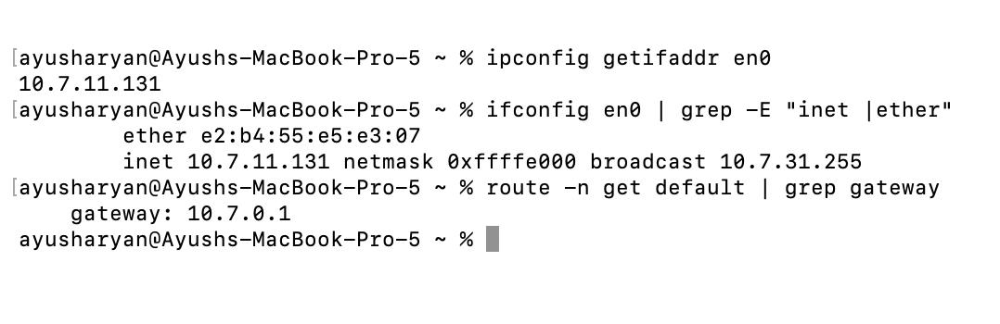
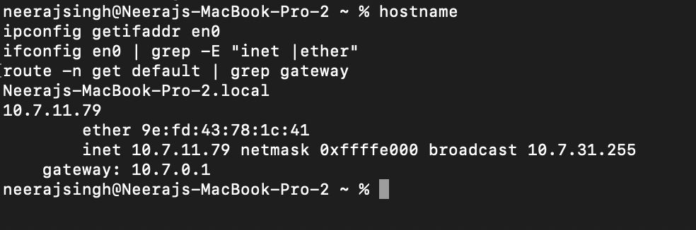
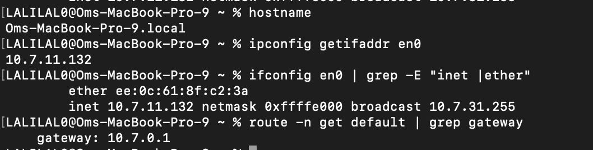
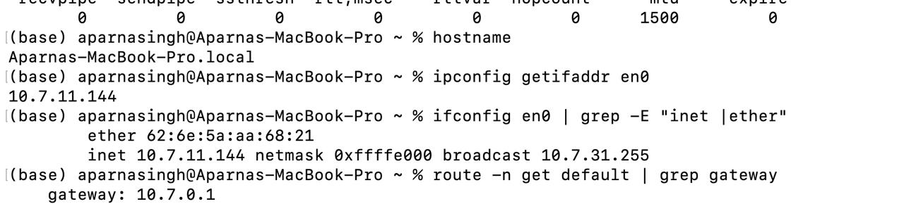

# Network Machine Details

| Machine | Role | IPv4 Address | Subnet Mask | Prefix | Default Gateway | Interface | MAC Address |
|---|---|---|---|---|---|---|---|
| Mac 1 | DNS | `10.7.11.132` | `255.255.224.0` | `/19` | `10.7.0.1` | `en0` | `ee:0c:61:8f:c2:3a` |
| Mac 2 | Edge / Reverse Proxy + Load Balancer (nginx) | `10.7.11.79` | `255.255.224.0` | `/19` | `10.7.0.1` | `en0` | `9e:fd:43:78:1c:41` |
| Mac 3 | Backend A | `10.7.11.144` | `255.255.224.0` | `/19` | `10.7.0.1` | `en0` | `62:6e:5a:aa:68:21` |
| Mac 4 | Backend B | `10.7.11.131` | `255.255.224.0` | `/19` | `10.7.0.1` | `en0` | `04:9d:05:d6:20:1f` |

## Individual Configuration Details

### Mac 1 — DNS

| Field | Details |
|---|---|
| IP Address | `10.7.11.132` |
| Subnet Mask | `255.255.224.0` |
| Prefix | `/19` |
| Default Gateway | `10.7.0.1` |
| Interface | `en0` |
| MAC Address | `ee:0c:61:8f:c2:3a` |

### Mac 2 — Edge / Reverse Proxy + Load Balancer

| Field | Details |
|---|---|
| IP Address | `10.7.11.79` |
| Subnet Mask | `255.255.224.0` |
| Prefix | `/19` |
| Default Gateway | `10.7.0.1` |
| Interface | `en0` |
| MAC Address | `9e:fd:43:78:1c:41` |

### Mac 3 — Backend A

| Field | Details |
|---|---|
| IP Address | `10.7.11.144` |
| Subnet Mask | `255.255.224.0` |
| Prefix | `/19` |
| Default Gateway | `10.7.0.1` |
| Interface | `en0` |
| MAC Address | `62:6e:5a:aa:68:21` |

### Mac 4 — Backend B

| Field | Details |
|---|---|
| IP Address | `10.7.11.131` |
| Subnet Mask | `255.255.224.0` |
| Prefix | `/19` |
| Default Gateway | `10.7.0.1` |
| Interface | `en0` |
| MAC Address | `04:9d:05:d6:20:1f` |

## Configuration Verification Screenshots

The following screenshots show the terminal output used to verify the hostname, IPv4 address, subnet mask, default gateway, interface, and MAC address for the machines.

### Mac 4 — Backend B

### Mac 2 — Edge / Reverse Proxy + Load Balancer

### Mac 1 — DNS

### Mac 3 — Backend A

