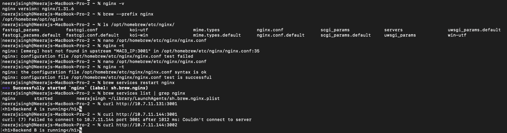
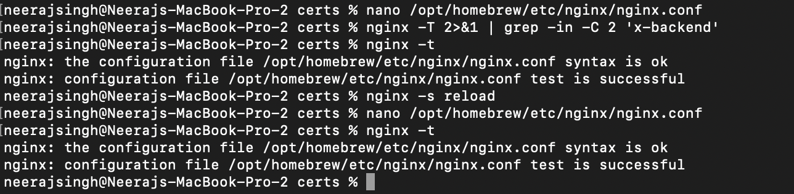

# Task 04 – Nginx Reverse Proxy and Load Balancer

## Objective

Configure Nginx on Mac 2 as the reverse proxy and load balancer for the
private network service platform.

## Work Performed

- Installed and verified Nginx on Mac 2.
- Configured an upstream containing Backend A and Backend B.
- Configured Nginx to forward client requests to the backend servers.
- Configured HTTPS/TLS support on the Nginx edge server.
- Tested the Nginx configuration using `nginx -t`.
- Reloaded Nginx after applying the configuration.
- Verified connectivity to the backend services.

## Evidence

### Nginx Setup and Backend Connectivity

### Nginx Configuration Validation

## Result

The Nginx configuration passed validation successfully:

`syntax is ok`

`test is successful`

Nginx was successfully reloaded with the updated configuration.