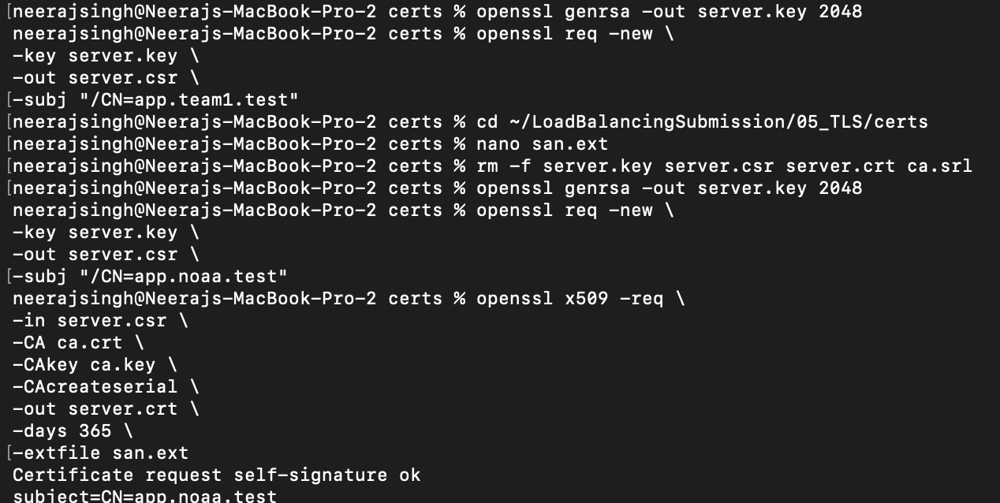
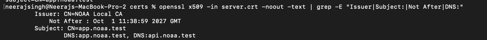
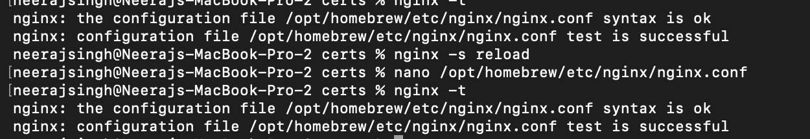

# Task 05 – TLS / HTTPS

## Objective

Configure TLS on the Nginx edge server so that clients can securely access
the private network service platform using HTTPS.

## Work Performed

1. Generated a private server key using OpenSSL.
2. Generated a Certificate Signing Request (CSR) for:
   - `app.noaa.test`
3. Created and used the NOAA Local CA to sign the server certificate.
4. Added Subject Alternative Names (SAN) for:
   - `app.noaa.test`
   - `api.noaa.test`
5. Verified the generated certificate using OpenSSL.
6. Configured the certificate and private key in Nginx.
7. Tested the Nginx configuration using `nginx -t`.
8. Reloaded Nginx after applying the TLS configuration.

## Certificate Details

The generated certificate contains:

- **Issuer:** NOAA Local CA
- **Subject:** `CN=app.noaa.test`
- **DNS:** `app.noaa.test`
- **DNS:** `api.noaa.test`
- **Validity:** 365 days

## Evidence

### 1. Certificate Generation

The server private key, CSR, and signed certificate were generated using
OpenSSL.

### 2. Certificate Verification

The certificate was inspected using OpenSSL to verify the issuer, subject,
validity period, and DNS SAN entries.

### 3. Nginx TLS Configuration Validation

The Nginx configuration was tested successfully and Nginx was reloaded.

## Result

The TLS configuration was successfully created and validated. The Nginx
configuration passed the syntax check and was successfully reloaded with
the TLS configuration.